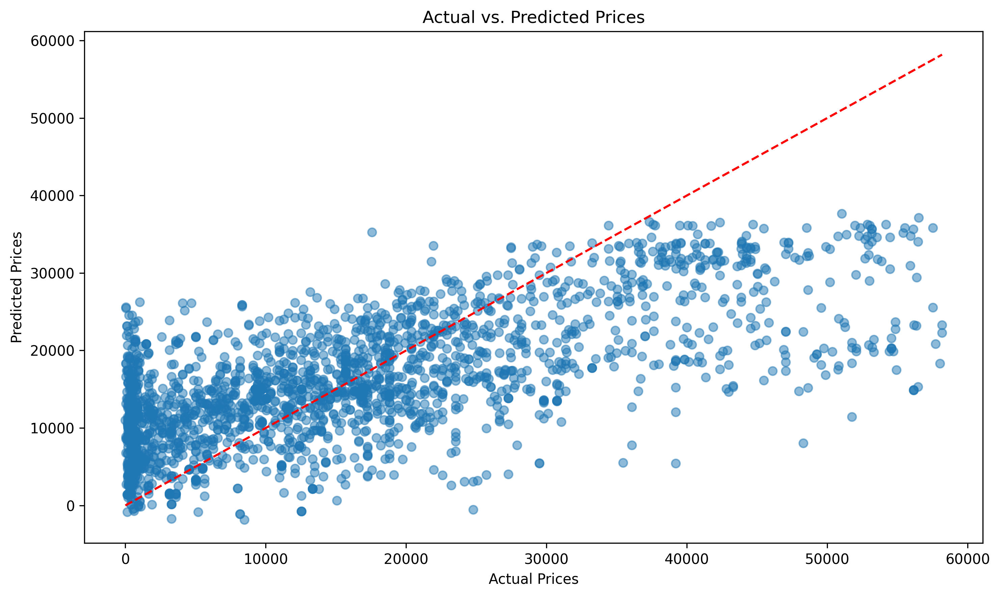
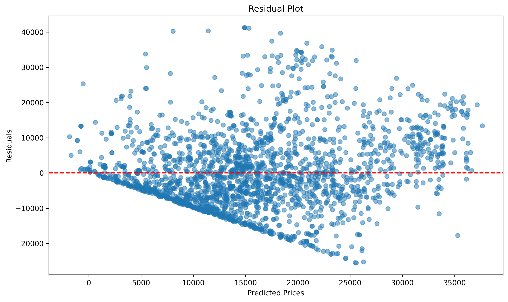
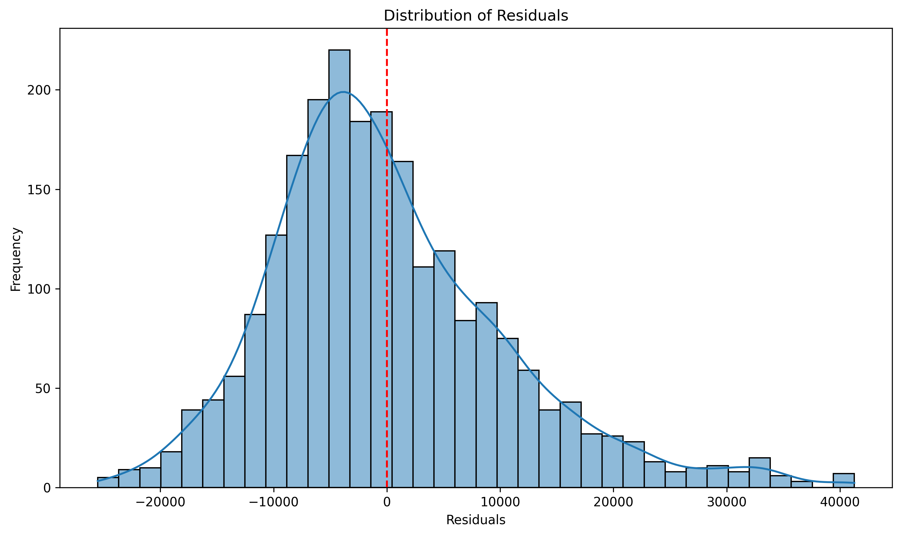
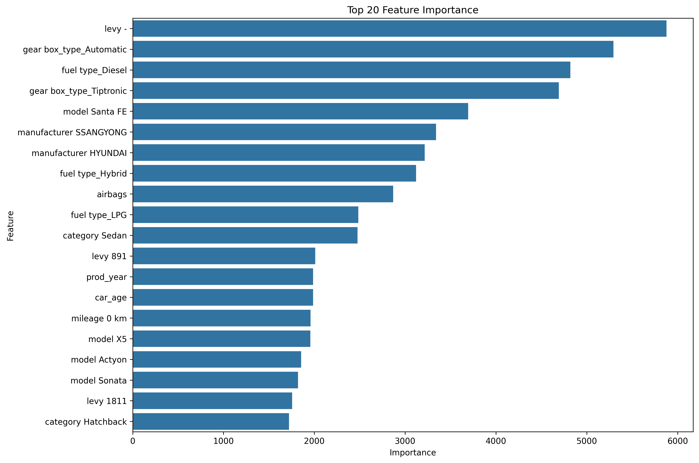

# Model Evaluation Report: elastic_net

Created on: 01.03.2025, 13:10:07

## Performance Metrics

- **MSE (Mean Squared Error)**: 111482956.71
- **RMSE (Root Mean Squared Error)**: 10558.55
- **MAE (Mean Absolute Error)**: 8064.98
- **R² (Coefficient of Determination)**: 0.4646

## Visualizations

### Statistical Summary

| Statistic | Actual | Predicted | Difference | Absolute Error |
|-----------|--------|-----------|------------|----------------|
| count | 2294.00 | 2294.00 | 2294.00 | 2294.00 |
| mean | 15838.60 | 15746.26 | 92.34 | 8064.98 |
| std | 14432.62 | 8139.25 | 10560.45 | 6816.11 |
| min | 3.00 | -1849.38 | -25530.23 | 5.10 |
| 25% | 3136.00 | 10119.58 | -6820.78 | 3126.98 |
| 50% | 13007.50 | 14894.41 | -1597.25 | 6428.75 |
| 75% | 23515.75 | 20824.95 | 5700.87 | 10894.00 |
| max | 58172.00 | 37641.87 | 41264.02 | 41264.02 |

### Actual vs. Predicted Prices

### Residual Plot

### Distribution of Residuals

### Feature Importance

#### Top 20 Features by Importance

| Feature | Importance |
|---------|------------|
| levy - | 5877.394389 |
| gear box_type_Automatic | 5292.957758 |
| fuel type_Diesel | 4818.628342 |
| gear box_type_Tiptronic | 4692.548076 |
| model Santa FE | 3694.346834 |
| manufacturer SSANGYONG | 3339.284086 |
| manufacturer HYUNDAI | 3215.885140 |
| fuel type_Hybrid | 3120.125580 |
| airbags | 2868.413769 |
| fuel type_LPG | 2485.048674 |
| category Sedan | 2474.875523 |
| levy 891 | 2009.194912 |
| prod_year | 1987.343769 |
| car_age | 1987.242961 |
| mileage 0 km | 1958.111065 |
| model X5 | 1956.480417 |
| model Actyon | 1855.359847 |
| model Sonata | 1820.104189 |
| levy 1811 | 1756.068329 |
| category Hatchback | 1721.208635 |

## Summary

The model **elastic_net** achieves an R² value of **0.4646** and an RMSE of **10558.55**.

The complete prediction data has been saved in `predictions.csv`.

Evaluation date: 01.03.2025, 13:10:08
