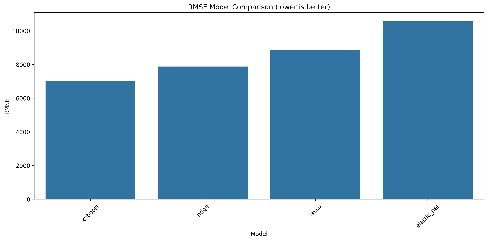
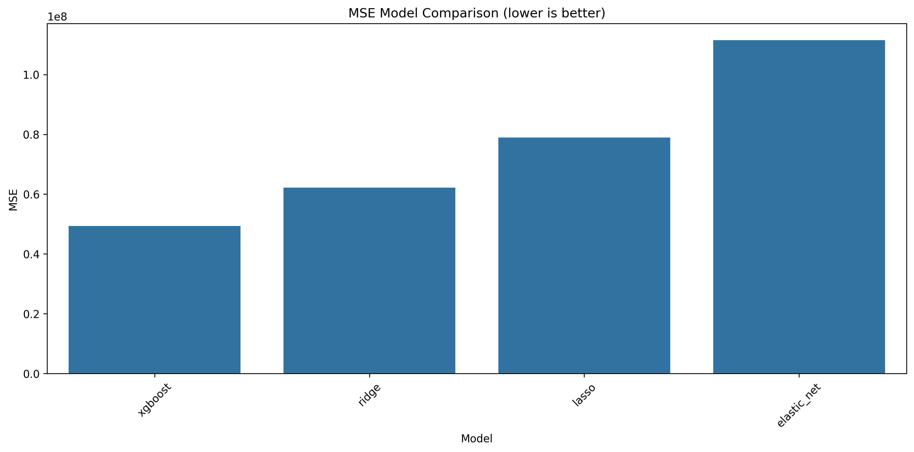
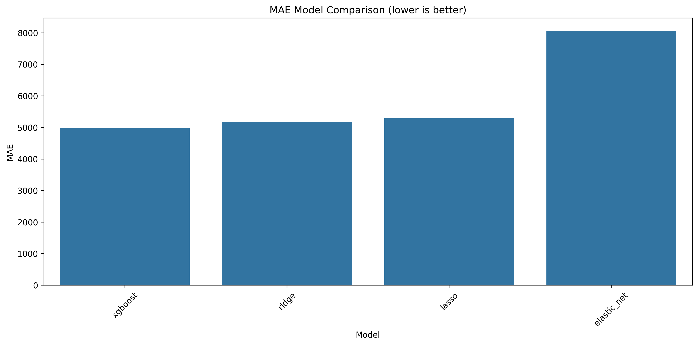
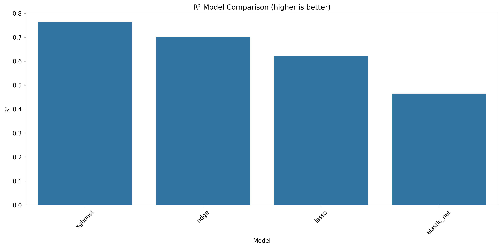

# Model Comparison Report

Created on: 04.03.2025, 10:37:21

## Model Performance Comparison

| Model | MSE | RMSE | MAE | R² |
|-------|-----|------|-----|-----|
| xgboost | 49386464.84 | 7027.55 | 4968.86 | 0.7628 |
| ridge | 62149647.30 | 7883.50 | 5174.46 | 0.7015 |
| lasso | 78967110.59 | 8886.34 | 5288.80 | 0.6207 |
| elastic_net | 111482956.71 | 10558.55 | 8064.98 | 0.4646 |

## Comparison Charts

### RMSE (Root Mean Squared Error)

### MSE (Mean Squared Error)

### MAE (Mean Absolute Error)

### R² (Coefficient of Determination)

## Summary

Based on the RMSE value, **xgboost** is the best model with an RMSE of **7027.55** and an R² value of **0.7628**.

The complete comparison data has been saved in [model_comparison.csv](model_comparison.csv).

Evaluation date: 04.03.2025, 10:37:21
