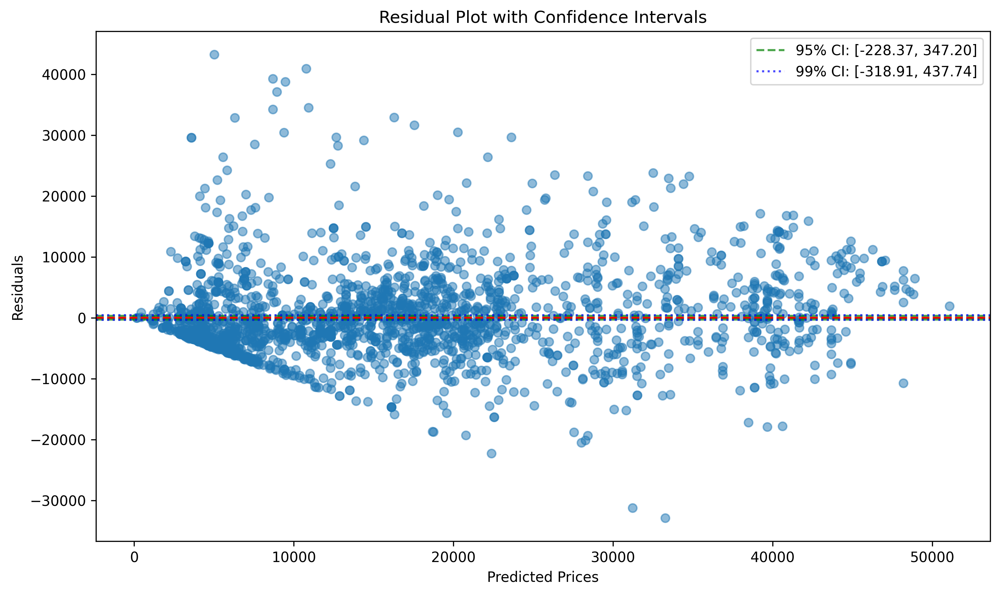
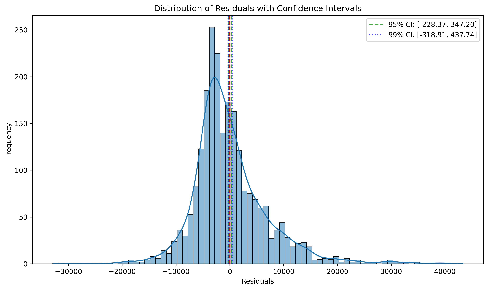
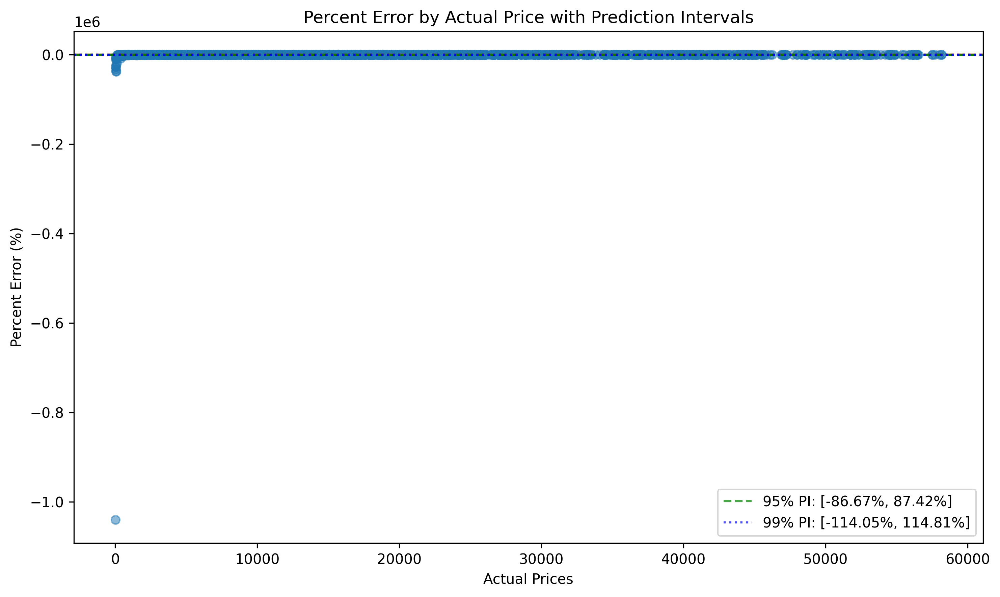

# Model Evaluation Report: xgboost

Created on: 01.03.2025, 13:18:05

## Performance Metrics

- **MSE (Mean Squared Error)**: 49386464.84
- **RMSE (Root Mean Squared Error)**: 7027.55
- **MAE (Mean Absolute Error)**: 4968.86
- **R² (Coefficient of Determination)**: 0.7628

### Confidence Intervals

#### 95% Confidence Interval
- **Mean Error**: 59.42 ± 287.78
- **Confidence Interval**: [-228.37, 347.20]
- **Prediction Interval**: [-13727.12, 13845.95]

#### 99% Confidence Interval
- **Mean Error**: 59.42 ± 378.33
- **Confidence Interval**: [-318.91, 437.74]
- **Prediction Interval**: [-18064.68, 18183.52]

## Visualizations

### Statistical Summary

| Statistic | Actual | Predicted | Error | Absolute Error | Percent Error (%) |
|-----------|--------|-----------|-------|----------------|-------------------|
| count | 2294.00 | 2294.00 | 2294.00 | 2294.00 | 2294.00 |
| mean | 15838.60 | 15779.19 | 59.42 | 4968.86 | -800.50 |
| std | 14432.62 | 11633.30 | 7028.83 | 4970.68 | 21792.58 |
| min | 3.00 | 159.41 | -32870.50 | 3.54 | -1040536.46 |
| 25% | 3136.00 | 5832.18 | -3855.65 | 1867.10 | -105.70 |
| 50% | 13007.50 | 13281.93 | -1343.26 | 3617.40 | -9.32 |
| 75% | 23515.75 | 21411.55 | 2839.81 | 6295.13 | 14.73 |
| max | 58172.00 | 51073.86 | 43290.70 | 43290.70 | 89.64 |

### Actual vs. Predicted Prices

### Residual Plot with Confidence Intervals

The green dashed lines represent the 95% confidence interval, and the blue dotted lines represent the 99% confidence interval.

### Distribution of Residuals with Confidence Intervals

The green dashed lines represent the 95% confidence interval, and the blue dotted lines represent the 99% confidence interval.

### Percent Error by Actual Price with Prediction Intervals

The green dashed lines represent the 95% prediction interval, and the blue dotted lines represent the 99% prediction interval.

## Confidence and Prediction Intervals

### What do these intervals mean?

- **95% Confidence Interval for Mean Error**: [-228.37, 347.20]  
  We are 95% confident that the true mean error of the model falls within this range.

- **99% Confidence Interval for Mean Error**: [-318.91, 437.74]  
  We are 99% confident that the true mean error of the model falls within this range.

- **95% Prediction Interval**: [-13727.12, 13845.95]  
  For a new prediction, we are 95% confident that the prediction error will fall within this range.

- **99% Prediction Interval**: [-18064.68, 18183.52]  
  For a new prediction, we are 99% confident that the prediction error will fall within this range.

## Summary

The model **xgboost** achieves an R² value of **0.7628** and an RMSE of **7027.55**.

On average, the model's predictions have an error of **59.42 ± 287.78** (95% confidence interval).

For individual predictions, we can expect errors to typically fall within **[-13727.12, 13845.95]** with 95% confidence.

The complete prediction data has been saved in `predictions.csv`.

Evaluation date: 01.03.2025, 13:18:06
